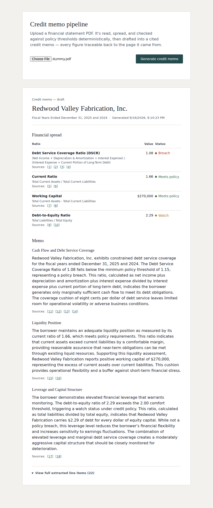

# Cited Credit Memo Pipeline

An agentic pipeline that reads a commercial financial statement, calculates lending
ratios, checks them against policy, and drafts a narrative credit memo — where every
figure traces back to the exact page and snippet it came from.

Built as a hands-on exploration of agentic AI development: the Microsoft Agent
Framework (`Microsoft.Agents.AI`), Claude, and .NET 10, applied to a real commercial
lending workflow rather than a generic chatbot demo.



## The core design rule

**Claude reads the document and writes the narrative. It never touches the math.**

Every ratio — Debt Service Coverage, Current Ratio, Working Capital, Debt-to-Equity —
is computed by plain, deterministic, unit-tested C#. The LLM is never asked to
calculate anything and is never shown a raw line item when drafting memo text; it
only ever sees already-computed, already-correct numbers. That separation isn't a
convention, it's enforced by the project structure itself: the calculation project
has zero dependency on anything AI-related, by design.

## Architecture

```
Northbridge.Demo.Core       Plain domain models. No logic, no dependencies.
Northbridge.Demo.Analysis   Deterministic ratio calculators + policy thresholds.
                            No AI, no HTTP — fully unit-testable in isolation.
Northbridge.Demo.Agents     The only project that talks to Claude.
                            ExtractionAgent: PDF in, structured + cited data out.
                            MemoAgent: computed ratios in, cited narrative out.
Northbridge.Demo.Api        ASP.NET Core Web API. Orchestrates the three stages
                            behind one endpoint. Serves the HTML memo viewer.
Northbridge.Demo.Tests      36 unit tests against Analysis — boundary values,
                            graceful degradation, and a real bug caught and fixed
                            along the way (see "Notes on process" below).
```

### Pipeline

1. **Upload** — a financial statement PDF is posted to `/api/credit-memo`.
2. **Extract** (`ExtractionAgent`) — the whole PDF is sent to Claude natively
   (no separate PDF-parsing library). Claude maps whatever it finds onto a fixed
   canonical vocabulary and reports a page number and snippet for every figure.
3. **Calculate** (`FinancialSpreadBuilder`, in `Analysis`) — plain C# arithmetic.
   Four ratios, each checked against policy thresholds. A missing source figure
   skips only the ratio that needed it, with a plain-English warning, rather than
   failing the whole spread.
4. **Draft** (`MemoAgent`) — Claude is given the *computed* ratios, their formulas,
   and their policy flags, and asked to write underwriting narrative. It names which
   ratios each section discusses; the actual citation objects are looked up from
   already-known data in code, never reconstructed by the model.
5. **Render** — a small HTML page (no framework, no build step) displays the memo
   with citations as clickable footnotes that reveal the source page and snippet.

## Tech stack

- .NET 10 / C# 14
- ASP.NET Core Minimal APIs
- `Microsoft.Agents.AI` + `Microsoft.Agents.AI.Anthropic` and `Microsoft.Agents.AI.OpenAI`
  (both connectors are referenced; which one runs is a runtime choice, not a compile-time one)
- Claude (Sonnet) or GPT, selected via configuration, called for document extraction and
  narrative drafting only
- xUnit for the Analysis test suite
- Vanilla HTML/CSS/JS for the memo viewer

## Running it

**Prerequisites:** .NET 10 SDK, Visual Studio 2026 (or `dotnet` CLI), an API key for whichever
provider you plan to use (Anthropic or OpenAI).

1. Clone the repo and open `NorthbridgeDemo.sln`.
2. Pick a provider in `Northbridge.Demo.Api/appsettings.json` (`Llm:Provider`, either
   `"Anthropic"` or `"OpenAI"`; defaults to `Anthropic`).
3. Set the matching API key via .NET User Secrets on the `Northbridge.Demo.Api` project:
   ```
   dotnet user-secrets set "AnthropicApiKey" "sk-ant-..." --project Northbridge.Demo.Api
   ```
   or, for OpenAI:
   ```
   dotnet user-secrets set "OpenAIApiKey" "sk-..." --project Northbridge.Demo.Api
   ```
   (Or right-click the project in Visual Studio → *Manage User Secrets*, and add either or
   both; only the key for the selected provider is actually read.)
4. Run `Northbridge.Demo.Api` (F5, or `dotnet run --project Northbridge.Demo.Api`).
5. Open the root URL in a browser, upload a financial statement PDF, and click
   *Generate credit memo*. (Swagger is also available at `/swagger` for direct
   API testing.)

A sample fictional financial statement is included at `docs/sample-statement.pdf` —
deliberately constructed with mixed financial health (one ratio in policy breach,
one in watch status, two healthy) rather than a uniformly clean borrower, so the
policy-flagging logic actually has something to do.

## Notes on process

A few decisions worth knowing about if you're reading the code:

- **Multi-period statements are handled deliberately, not accidentally.** An early
  version of `FinancialExtractionResult.Find()` returned whichever line item came
  first in the list, with no regard for reporting period — invisible against
  hand-built single-period test data, but wrong the moment a real statement shows
  two years side by side. Caught by a unit test written alongside the fix, not after.
- **PDF size/page limits are checked before any request is sent** (`PdfLimitGuard`),
  against Claude's documented Messages API limits, rather than letting an oversized
  file fail deep inside the pipeline with a generic error.
- **No official Anthropic C# SDK existed when this started**, so the first version
  of the Claude integration was a hand-rolled `IChatClient` adapter. It was replaced
  once `Microsoft.Agents.AI.Anthropic` was confirmed to work — a maintained official
  connector beats a hand-rolled one every time it's available.

## What I'd do differently in production

- Surface line items Claude couldn't confidently map, instead of silently dropping
  them — a human reviewer should see what was skipped, not just what was extracted.
- Make policy thresholds configurable and versioned per institution, rather than
  hardcoded constants, since credit policy changes over time and audits need to
  know which threshold applied when.
- Build an actual evaluation set of real (or realistic) statements with known-correct
  extractions, to measure extraction accuracy over time rather than trusting one
  sample looks right.
